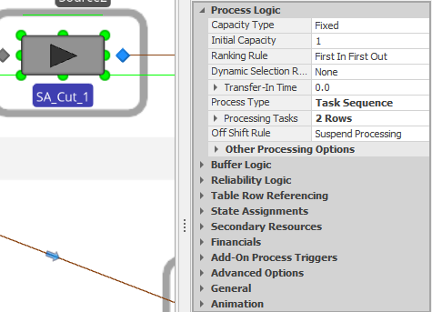

# Simio 2021 May Student Competition
## Demand Driven Materials Requirement Planning (DDMRP)
### Fase 2

### SIMI∞S

|Carnet|Nombre|
|-|-|
|201602820|Luis Alfonso Melgar Arizpe|
|201602916|Ricardo Antonio Menéndez Tobías|
|201612141|Diego Estuardo Gómez Fernández|
|201602420|Ingrid Rossana Pérez Mena|

---
## Diseño del Sistema

### Tablas de datos

Para almacenar informacion importante dentro del sistema se cargaron algunas tablas a *Data Tables* dentro de Simio. Estas tablas nos permiten ingresar a esta informacion de forma simple y eficiente.

### Entidades

#### Material

La entidad Material se utiliza para simular tanto la materia prima (Tablas de madera, tornillos, brackets y pintura) como los productos ya procesados (BP, FA, SA y productos completos).
Esta entidad almacena en sus propiedades toda la informacion del material asi como informacion importante para el proceso del producto final.

### Estaciones

Para cada tipo de estacion se definio el objeto en Simio mas adecuado para cumplir con los requisitos descritos.

- **Inventory Keys** Para estas estaciones se utilizaron elementos Source, debido a que su funcion es generar los diferentes materiales. Estos Source generan una entidad *Material* al ser llamados por un evento y asignan los valores respectivos a esta entidad.

  
  
- **Estaciones de corte** Para estas estaciones se utilizaron elementos Server, debido a que su funcion es cortar una tabla de madera en un determinado tiempo. Estos servidores tienen tiempos de procesamiento asociados a sus tareas. Al terminar el corte, la madera pasa a ser una parte del producto final, por lo que se modifica su tipo.

  

- **Estaciones de trazado** Para estas estaciones se utilizaron elementos Server, debido a que su funcion es trazar en la madera. Estos servidores tienen tiempos de procesamiento asociados. 

  

- **Estaciones de perforado** Para estas estaciones se utilizaron elementos Server, debido a que su funcion es perforar la madera para que se puedan introducir los tornillos y brackets. Estos servidores tienen tiempos de procesamiento asociados. 

  

- **Estaciones de Ensamblado y de Fijado** Para estas estaciones se utilizaron elementos Combiner, debido a que su funcion es ensamblar y fijar diferentes materiales entre si (Maderas, Paneles, Tornillos y Brackets). Cada estacion tiene asociada la cantidad de tipos de materiales que deben ensamblar, cuando se llega a esta cantidad la entidad sale de la estacion. Al ingresar el padre (paneles) a la estacion, solicita a los invetarios cercanos los materiales que debe ensamblar (Tornillos ,Brackets o Paneles). Esta estacion tiene tiempos de procesamiento asociados.

  

- **Estaciones de Pintado** Para estas estaciones se utilizaron elementos Combiner, debido a que su funcion es pintar una pieza. Al ingresar la pieza la estacion solicita al inventario de pintura mas cercano la cantidad y el tipo de pintura que necesita. Luego de pintarla la entidad sale de la estacion. Esta estacion tiene tiempos de procesamiento asociados.

  

- **Estaciones de Curado** Para estas estaciones se utilizaron elementos Server, debido a que su funcion es retener la pieza mientras se cura. Esta estacion tiene tiempos de procesamiento asociados y la cantidad determinada de piezas que puede almacenar al mismo tiempo.

  

- **Estaciones de Almacenamiento** Para estas estaciones se utilizaron elementos Sink, debido a que su funcion es simular el almacenamiento de la pieza en el inventario respectivo. Cuando ingresa una entidad a esta estacion se ejecuta un proceso el cual gestiona el inventario.

  

### Tiempos de procesamiento

Cada una de las estaciones cuenta con dos tipos de tiempos de procesamiento:

1. **Tiempo de preparacion** : Tiempo que le toma a el trabajador preparar la estacion de trabajo (Limpieza, ajustes, ordenamiento,etc.). Estos tiempos siguen una distribucion triangular.

2. **Tiempo de ejecucion** : Tiempo que le toma a el trabajador o a la maquina realizar el proceso que tiene asociado. Estos tiempos siguen diferentes distribuciones para cada tipo de Material y estacion.

### Colas únicas FIFO

Se configuraron colas únicas para las colas de ingreso a las estaciones. Estas colas mantienen en espera a los diferentes materiales y piezas cuando todas las estaciones disponibles estan ocupadas. Las colas tienen un comportamiento FIFO (Primero que entra, primero que sale).

Para la configuracion de las colas se utilizaron Nodos en donde se unen los caminos que llevan a esta cola. El nodo tiene configurado una lista de destinos, los cuales son las estaciones a las que lleva la cola. Los caminos no permiten el paso de las entidades hasta que hay alguna estacion disponible.

### Procesos principales

#### Obtener materiales de un producto

Este proceso se utiliza para recorrer la BOM Matrix, la cual describe los diferentes materiales que se utilizan en el proceso de produccion. El proceso recorre cada una de las filas de esta matriz para iniciar el proceso de generacion de materiales respectivo a cada producto. Para iniciar el proceso de produccion, se genera el primer Material de el producto, con la informacion importante para poder generar el producto completo

#### Generar Materiales

Para la generacion de estos materiales se utilizaron procesos que asignan variables globales que almacenan las caracteristicas de estos materiales. Luego de asignar las variables generar una nueva entidad en el Source respectivo (Invetory Key).

---
## Modelos Finales

Modelo 1

Modelo 1 completo

Modelo final 

## Conclusiones
*  SIMIO es una herramienta muy poderosa para modelar y simular que ofrece las capacidades necesarias para analizar los datos proporcionados.
*  Con ayuda del lenguaje de programación R se puede realizar un análisis de datos que permita determinar las distribuciones de probabilidad para los flujos del sistema, y sus respectivos parámetros.
*  SIMIO no es una herramienta optima para proceso ETL, pero puede llegar a cumplir con esta función.
*  El uso de librerias de R nos permite la automatización en la toma decisiones de procesos de analisis de datos. 
*  La funciónalidad de SIMIO de interactuar con archivos de Excel nos da bastante flexibilidad a la hora de manejar fuentes de datos.
