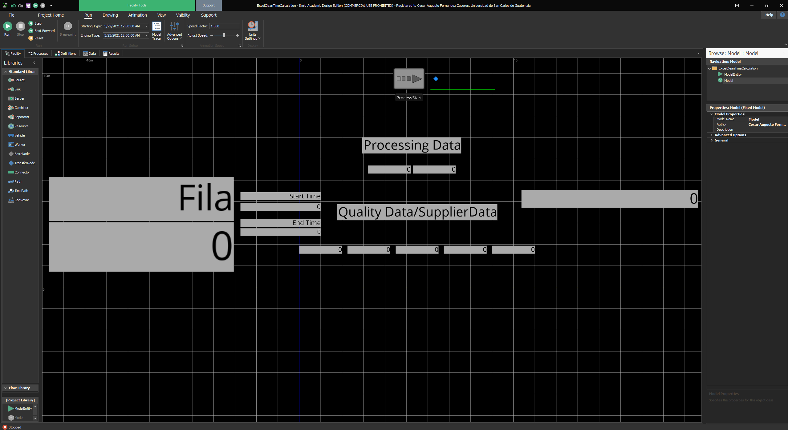
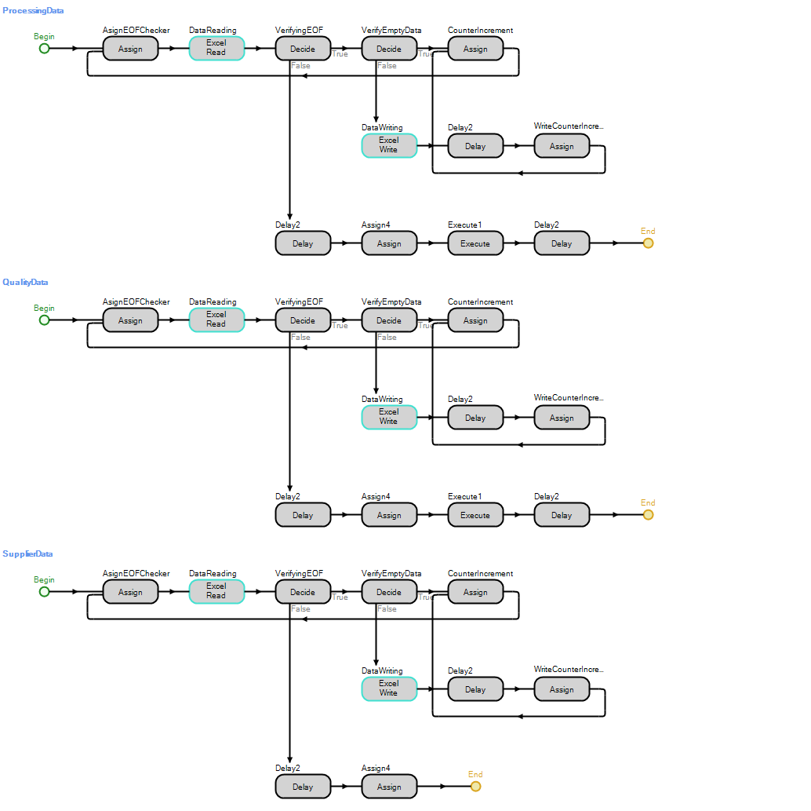
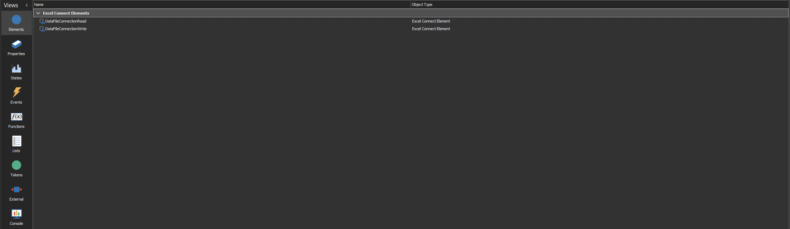
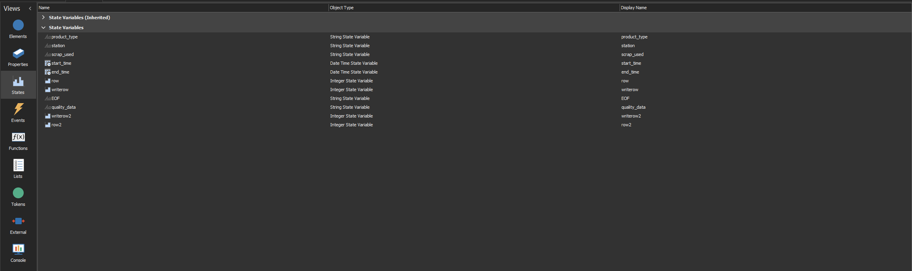

# Simio 2021 May Student Competition
## Demand Driven Materials Requirement Planning (DDMRP)
### Fase 1

### SIMI∞S

|Carnet|Nombre|
|-|-|
|201602820|Luis Alfonso Melgar Arizpe|
|201602916|Ricardo Antonio Menéndez Tobías|
|201612141|Diego Estuardo Gómez Fernández|
|201602420|Ingrid Rossana Pérez Mena|


## Diseño del sistema

Se cuenta con un source que es el encargado de iniciar el proceso de extracción y modificación de los datos, específicamente para eliminar los valores incorrectos y calcular los tiempos entre dos fechas que son proporcionadas. Además cuenta con status label para mostrar en tiempo real el desempeño de los procesos en la lectura y escritura de datos.
### Procesos

* ProcessingData: se encarga de hacer el análisis de los datos de la hoja con el mismo nombre, el proceso asigna valores vacíos a todos las variables temporales, luego hace una lectura, el VerifyingEOF verifica el final del archivo si ninguno de los datos tuvo un cambio respecto a los valores asignados al principio, si no es el fin del archivo procede a verificar si alguno de los campos es vacío ya que de esta forma es un dato inválido, si es inválido procede al siguiente, si no lo es escribe el nuevo dato en el archivo de salida, calculando el tiempo entre las dos fechas proporcionadas. Luego aumenta las respectivas variables y procede con la siguiente fila. Cuando encuentra el final del archivo ejecuta el siguiente proceso QualityData.
* QualityData: se encarga de hacer el análisis de los datos de la hoja con el mismo nombre, el proceso asigna valores vacíos a todos las variables temporales, luego hace una lectura, el VerifyingEOF verifica el final del archivo si ninguno de los datos tuvo un cambio respecto a los valores asignados al principio, si no es el fin del archivo procede a verificar si alguno de los campos es vacío ya que de esta forma es un dato inválido, si es inválido procede al siguiente, si no lo es escribe el nuevo dato en el archivo de salida, calculando el tiempo entre las dos fechas proporcionadas. Luego aumenta las respectivas variables y procede con la siguiente fila. Cuando encuentra el final del archivo ejecuta el siguiente proceso SupplierData.
* SupplierData: se encarga de hacer el análisis de los datos de la hoja con el mismo nombre, el proceso asigna valores vacíos a todos las variables temporales, luego hace una lectura, el VerifyingEOF verifica el final del archivo si ninguno de los datos tuvo un cambio respecto a los valores asignados al principio, si no es el fin del archivo procede a verificar si alguno de los campos es vacío ya que de esta forma es un dato inválido, si es inválido procede al siguiente, si no lo es escribe el nuevo dato en el archivo de salida, calculando el tiempo entre las dos fechas proporcionadas. Luego aumenta las respectivas variables y procede con la siguiente fila. Cuando encuentra el final del archivo ejecuta el siguiente proceso QualityData.
* QualityData: se encarga de hacer el análisis de los datos de la hoja con el mismo nombre, el proceso asigna valores vacíos a todos las variables temporales, luego hace una lectura, el VerifyingEOF verifica el final del archivo si ninguno de los datos tuvo un cambio respecto a los valores asignados al principio, si no es el fin del archivo procede a verificar si alguno de los campos es vacío ya que de esta forma es un dato inválido, si es inválido procede al siguiente, si no lo es escribe el nuevo dato en el archivo de salida, calculando el tiempo entre las dos fechas proporcionadas. Luego aumenta las respectivas variables y procede con la siguiente fila, hasta encontrar el final del archivo.
### Elementos

Una conexión a Excel para leer los datos proporcionados por Simio, el DataFile.xlsx y una conexión a para escribir los datos calculados, el DataFileOut.xlsx

Las variables temporales utilizadas para almacenar los datos leídos del excel de entrada.
## Analisis para distribuciones

### Metodo 1
Para analizar la informacion del procesamiento de materiales en cada una de sus estaciones (Hoja Processing Data) realizaron los siguientes pasos:

1. Se carga el archivo de Excel que contiene los tiempos en segundos de los diferentes pasos.
2. Se obtienen las diferentes combinaciones de Productos y Estaciones.
3. Configuramos la funcion DistPlus de la libreria EnvStats para que nos ayude a encontrar la distribucion de probabilidades que mas se acerca al grupo de datos. Las configuraciones realizadas fueron las siguientes:
    - Los datos a evaluar (Tiempo en segundos)
    - El error tipo 1 asociado a la prueba.
    - El metodo para elegir la distribucion (Para este caso se utilizo el metodo Shapiro-Wilk)
    - Las distibuciones a evaluar (Gamma, Weibull y Normal).
4. Ejecutamos la funcion DistPlus para encontrar la distribucion elegida.
5. Utilizando la funcion Fitdist de la libreria FitDistrPlus calculamos los parametros obtenidos para la distribucion elegida.
6. Almacenamos los resultados en una matriz.
7. Al finalizar todas las combinaciones, se escribe la matriz en un archivo de Excel.

```R
library(MASS)
library(survival)
library(fitdistrplus)
library(rriskDistributions)
library(dplyr)
library(utf8)
library(EnvStats)
library("xlsx")

help("EnvStats")

# LEER CSV
data <- read.csv(file.choose(), header = TRUE, sep = ";",na.strings = c("","NA"),colClasses=c("numeric","character","character","character"))

# LEER XLSX
data <- read.xlsx(file.choose(),1, header=TRUE)

data

disitruciones <- c("gamma","weibull","exp","norm")

names(distribuciones) <- c("Gamma","Weibull","Exponential","Normal")

nombres <- data[,c("Producto","Estacion")]

nombres = na.omit(nombres)


combinaciones <- nombres %>% distinct(Producto,Estacion)

nrow(combinaciones)

excel = matrix(,nrow=nrow(combinaciones),ncol=5)

for (i in 1:dim(combinaciones)[1]){

filtro_producto <- combinaciones[i,1]
filtro_estacion <- combinaciones[i,2]

datos <- filter(data, Estacion == filtro_estacion & Producto == filtro_producto)

resultado <- distChoose(datos$Tiempo, alpha = 0.05, method = "sw",
           choices = c( "gamma" , "weibull"  ,"norm"), est.arg.list = NULL,
           warn = TRUE, keep.data = TRUE, data.name = NULL,
           parent.of.data = NULL, subset.expression = NULL)

if(resultado$decision == "Nonparametric") {
  resultado$decision = "Normal"
}

resultado_dist <- distribuciones[[resultado$decision]][2]

ajuste <- fitdist(datos$Tiempo, resultado_dist)

excel[i,1] <- filtro_estacion
excel[i,2] <- filtro_producto
excel[i,3] <- resultado$decision
excel[i,4] <- ajuste[[1]][1]
excel[i,5] <- ajuste[[1]][2]
cat(sprintf("Para la combinacion %s y %s la dist. es : %s (%s) \n",filtro_producto,filtro_estacion,resultado$decision,resultado_dist))

}

colnames(excel) = c("Estacion","Producto","Distribucion","Parametro_1","Parametro_2")

write.xlsx(excel, "Distribuciones Processing Data.xlsx", sheetName = "Distribuciones Processing Data", 
           col.names = TRUE, 
           row.names = FALSE, append = FALSE)
```

Extracto de la salida que genera el archivo:

|Estacion|Producto|Distribucion|P1|P2|
|-|-|-|-|-|
|SA_Cut_1|B22_SA|Normal|121.913612565445|15.9257233074546|
|FA_Cut_2|B22_FA|Normal|231.065656565657|12.9992514284567|
|FA_Cut_1|B22_FA|Normal|229.094240837696|13.1165344007269|
|BP_Cut_1|B22_BP|Normal|127.6|7.08458547491322|
|SA_Routing_1|B22_SA|Normal|31.911838790932|1.792732570611|
|BP_Drill_1|B22_BP|Normal|339.95|22.4700832854964|
|SA_Drill_1|B22_SA|Normal|341.742647058824|23.7830254357059|


Este metodo se utilizo para la hoja de Processing Data debido a la cantidad de datos que esta contiene. Existen mas de 36,000 tomas de datos para los tiempos de procesamiento, y aproximadamente 190 combinaciones de productos y estaciones, por lo que se opto en realizar una eleccion de distribucion de forma automatica en base a un algoritmo para facilitar y optimizar el proceso.
Esto presenta algunas limitaciones como la cantidad de pruebas que se pueden evaluar.


### Metodo 2
Para analizar la información generada sobre las hojas Quality Data y Supplier Data se utilizó un segundo método, en donde se realiza lo siguiente:

1. Se carga el archivo de Excel que contiene en la primera columna los tiempos en segundos, en la segunda contiene el material y en la tercera el proveedor.
2. Se analiza celda por celda la tabla generada a partir del archivo de excel
    - Se guardan los valore de proveedor y material
    - Se guarda el dato de tiempo en un arreglo
    - Si el dato de tiempo es -1, se realiza la elección de la distribución, ya que significa que terminaron lo datos de esa combinación.
3. Se guarda una matriz con las combinaciones y distribuciones seleccionadas para cada una.
4. Se genera un archivo excel a partir de la matriz guardada.

#### Script

El archivo de excel generado tiene los siguientes datos:
(extracto)

|Tiempo|Material|Supplier Name|
|-|-|-|
|1070|MAT006|King's Supply Company|
|983|MAT006|King's Supply Company|
|881|MAT006|King's Supply Company|
|891|MAT006|King's Supply Company|
|1033|MAT006|King's Supply Company|
|1115|MAT006|King's Supply Company|
|...|
|-1|		
|558|MAT002|Highe's Lumber|
|831|MAT002|Highe's Lumber|
|737|MAT002|Highe's Lumber|
|674|MAT002|Highe's Lumber|

Se carga este archivo de excel a R:

```R
data <- read.xlsx(file.choose(),3, header=TRUE)
```

Después de esto se realiza un ciclo en donde se va analizando fila por fila del excel:
```R
datos = {} #Donde se guardarán los datos de tiempo de cada combinación
matriz = matrix(, nrow=7,ncol=5) #La matriz que se generará con la información de distribución
i = 0  #Fila de la tabla original que se está analizando
imatriz = 1 #Fila de nueva matriz que se está generando
for(i in 1:length(data[,1])){
  celda = data[,1][i] #Tiempo
  if(celda == -1){
    dist <- fit.cont(datos) #Se analiza y selecciona la distribución
    matriz[imatriz,1] = data[,2][i-1] #Se escribe el material
    matriz[imatriz,2] = data[,3][i-1] #Se escribe el proveedor
    matriz[imatriz,3] = dist$chosenDistr #Se escribe el nombre de la distribución seleccinoada
    x = 4
    for(param in dist$fittedParams){ #Se escriben los parámetros de la distribución seleccionada
      matriz[imatriz,x] = param
      x = x + 1
    }
    imatriz = imatriz + 1
    i = i + 1
    next
  }
  datos = c(datos, celda) #Se guarda el dato de tiempo en el arreglo
  i = i + 1
}
```

Se escriben los nombres de las columnas de la matriz
```R
colnames(matriz) = c('Material','Supplier','Distribucion','Param1','Param2')
```

Por último, se genera el archivo de excel con la matriz generada
```R
write.xlsx(matriz, "Distribuciones Salida.xlsx", sheetName = "Distribuciones Salida", 
           col.names = TRUE, 
           row.names = FALSE, append = FALSE)
```

Archivo generado
|Supplier|Material|Distribucion|Param1|Param2|
|-|-|-|-|-|
|Building Center|MAT005|logis|13617.3906517334|33.0334431154313|
|Club Hardware|MAT007|norm|13618.1428571429|55.5371910690191|
|Highe's Lumber|MAT002|unif|13521.7178859735|13715.2450769895|
|Incity Timber|MAT001|gamma|59112.5540578114|4.34070981885869|
|Jone's Paint Store|MAT004|weibull|268.560003913513|13646.3509966749|
|King's Supply Company|MAT006|norm|13618.7934782609|56.3396219453519|

## Modelo Final

## Conclusiones
*  SIMIO es una herramienta muy poderosa para modelar y simular que ofrece las capacidades necesarias para analizar los datos proporcionados.
*  Con ayuda del lenguaje de programación R se puede realizar un análisis de datos que permita determinar las distribuciones de probabilidad para los flujos del sistema, y sus respectivos parámetros.
